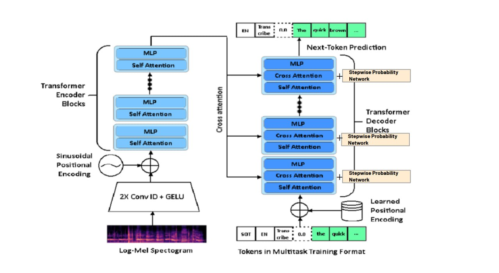
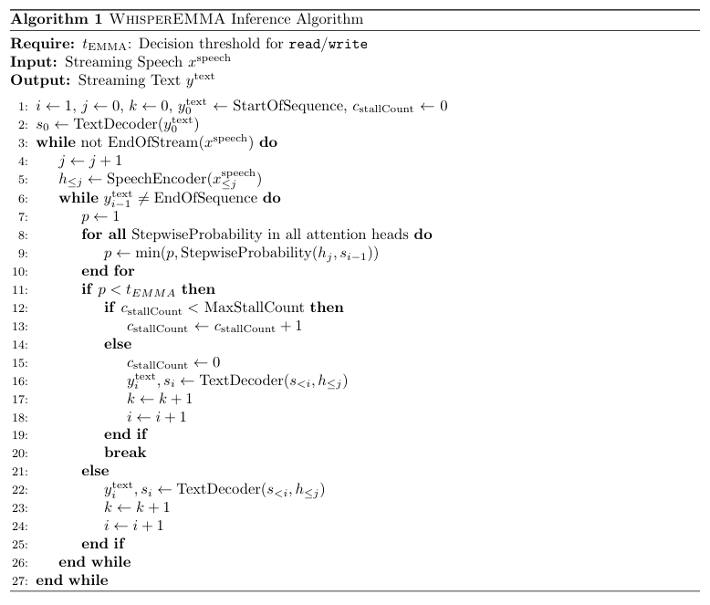

# WhisperEMMA 
**Group 5 Team Members:**
- Keith Low 1005866
- Lee Le Xuan 1006029
- Luv Singhal 1006250

## Whisper 
WhisperEMMA is a streaming speech recognition framework based on OpenAI's Whisper. We introduce an EMMA-style modulation mechanism integrated directly into Whisper's text decoder to support low-latency transcription suitable for edge devices.


At a high level, Whisper comprises an audio encoder and a text decoder. We extend Whisper by injecting a stepwise probability network (`PChooseLayer`) into each `MonotonicResidualAttentionBlock` within the `MonotonicTextDecoder`, enabling monotonic attention during training and efficient streaming inference.



## Inference
The WhisperEMMA inference algorithm enables real-time transcription by processing audio incrementally and deciding at each step whether to emit a text token or wait for more input. 

It begins by initializing the output with a start-of-sequence token and processes incoming audio chunks through a speech encoder to generate partial hidden states. These are passed, along with the previously generated text, to a policy network that produces a score indicating whether the model is confident enough to generate the next token. If this score exceeds a predefined threshold $(t_{EMMA})$, the model proceeds to decode the next token. Otherwise, it stalls and waits for additional audio. 

To avoid stalling indefinitely, the system tracks the number of consecutive stalls, and if a maximum stall count is reached, it forces the model to decode even if it lacks confidence. 

This balance ensures low-latency transcription without freezing or excessive delays.



## Monotonic Alignment Estimation
In global attention, the model is allowed to focus on all parts of the input sequence when making predicitons. However, in a streaming setting, given an input sequence of length $l$, a model at time step $t$, $t \lt l$ is only allowed to focus on the first $t$ tokens of the sequence.

Monotonic alignment further constraints the attention to maintain a strict left-to-right alignment. This assumes that input sequences are monotonically increasing, following a sequential order. In our case, the monotonic alignment in speech models aligns input audio frames to output text tokens in a sequential, left-to-right (according to time) order.

## Simultaneous Finetuning
Denote the simultaneous model as $M(\theta_e, \theta_d, \theta_p)$, where $\theta_e$ is the encoder, $\theta_d$ is the decoder, and $\theta_p$ is the policy network.

During training, the encoder parameters remain fixed, while optimization is performed only on the decoder and policy parameters. This design is motivated by the assumption that the generative components of the model, namely the encoder and decoder, should closely resemble those of the offline model. In simultaneous setting, they are adapted to partial contextual information.

To assess the impact of different finetuning strategies, we consider two variants: *WhisperEMMA-PChoose_Only*, which updates only the policy network, and *WhisperEMMA-Cross_Attn*, which additionally finetunes the cross-attention value projections within the decoder.

## Use Case
Streaming models such as [SeamlessStreaming](https://github.com/facebookresearch/seamless_communication) inspired the development of WhisperEMMA. However, due to their large size, such models may not be suitable for deployment on edge devices. To address this, we aimed to bring streaming capabilities to the more lightweight Whisper model.

WhisperEMMA opens up the possibility to low-latency, offline transcription on edge devices like the [NVIDIA Jetson Orin NX](https://developer.nvidia.com/downloads/jetson-orin-nx-series-data-sheet). Its resource-efficient streaming architecture makes it well-suited for on-device speech applications that demand real-time responsiveness and prioritize user privacy.

## Setup
We used Python 3.10, PyTorch 2.1.0, CUDA 11.8.0 to train and test our models, but the codebase is
expected to be compatible with Python 3.8-3.11 and recent PyTorch versions. The codebase also depends
on a few Python packages, most notably OpenAI’s tiktoken for their fast tokenizer implementation.
To clone the code repository and update package requirements, please run:

```bash
git clone https://github.com/keeve101/whisper-emma
pip install -r requirements.txt
```

It also requires the command-line tool [`ffmpeg`](https://ffmpeg.org/) to be installed on your system, which is available from most package managers:

```bash
# on Ubuntu or Debian
sudo apt update && sudo apt install ffmpeg

# on Arch Linux
sudo pacman -S ffmpeg

# on MacOS using Homebrew (https://brew.sh/)
brew install ffmpeg

# on Windows using Chocolatey (https://chocolatey.org/)
choco install ffmpeg

# on Windows using Scoop (https://scoop.sh/)
scoop install ffmpeg
```


## Implementation
The computations for `alpha` as described in our report are implemented in `PChooseLayer._monotonic_alignment`.

The computations for `p_choose` as described in our report are implemented in `MonotonicTextDecoder.decode_with_pchoose`.

The computations for $\beta$ and modulation mechanism as described in our report are implemented in `MultiHeadAttention.forward`.

## Finetuning
Our finetuning script is in `finetune-whisper-policy-network.py`. 

All detailed explanations can be found in our report (`report.pdf`), including the training and evaluation procedures.

To run finetuning, simply run the following command:

```bash
python finetune-whisper-policy-network.py
```

You can also specify the model checkpoints and the training parameters in the script. Details of our training parameters can also be found in our report.

Our finetuned model weights can be found on HuggingFace: https://huggingface.co/keeve101/whisper-emma.

## Evaluation
For evaluation, please checkout to our evaluation branch via:
```bash
git checkout evaluation
```

To evaluate the finetuned model on a test example, run the following command:
```bash
python test.py
```

To run full evaluation on the test set and get the results, run the following command:
```bash
python get_results.py
```

For baseline evaluation, we have a script to test [whisper_streaming](https://github.com/ufal/whisper_streaming):
```bash
python test_whisper_streaming.py
```

## Acknowledgements
We thank Prof. Matthieu and Prof. Qun Song for their guidance for this 2025 Spring 50.039 Deep Learning course.

We thank the authors of [Whisper](https://github.com/openai/whisper), [SeamlessCommunication](https://github.com/facebookresearch/seamless_communication/tree/main) for their open-source implementations. 
